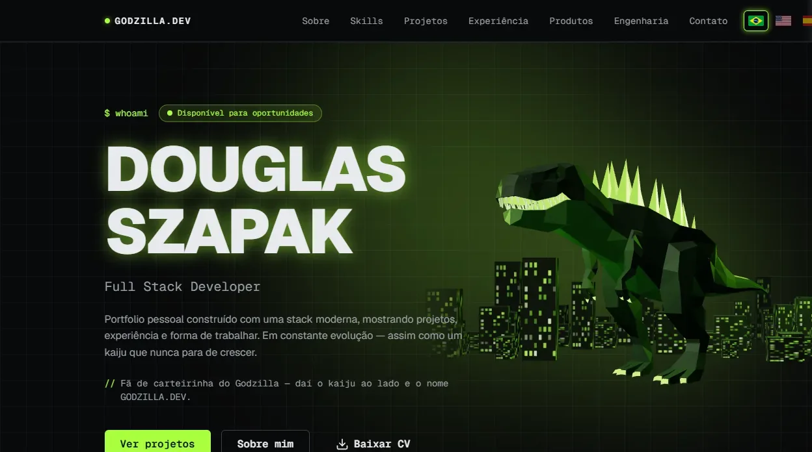
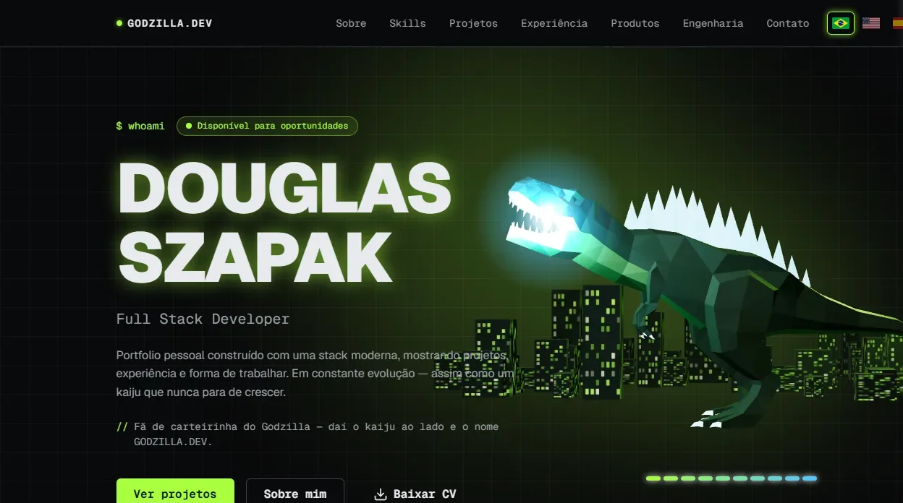
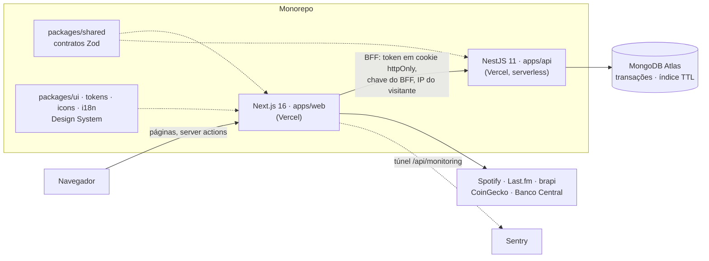

# GODZILLA.DEV — portfólio de Douglas Szapak

[](https://github.com/douglasvsf/portfolio/actions/workflows/ci.yml)


-%E2%89%A580%25-brightgreen)


Portfólio full stack que também é um projeto de produção: site em três idiomas,
quatro produtos no ar, uma API com regras de negócio de verdade e o mesmo
padrão de testes, CI, segurança e observabilidade que uso no trabalho.

**No ar:** https://douglas-szapak.vercel.app · **API (Swagger):** https://portfolio-api-psi-one.vercel.app/docs

[](https://douglas-szapak.vercel.app)

## O que tem aqui

| Produto | Rota | O que demonstra |
|---|---|---|
| **Portfólio** | [`/pt-BR`](https://douglas-szapak.vercel.app/pt-BR) · `/en-US` · `/es-ES` | Cases de engenharia, i18n, SEO (imagem de compartilhamento e dados estruturados por página), currículo em PDF gerado do próprio conteúdo, kaiju 3D interativo |
| **GODZILLA ERP** | [`/erp`](https://douglas-szapak.vercel.app/erp) | Mini-ERP de mercado: API NestJS + MongoDB, estoque com livro-razão, pedidos em transação, frente de caixa (PDV), contas por convite e painel do dono |
| **GODZILLA Pay** | [`/pay`](https://douglas-szapak.vercel.app/pay) | Gateway Pix de demonstração: API NestJS + PostgreSQL, BR Code do Banco Central, livro-caixa de partidas dobradas, idempotência e webhooks assinados com novas tentativas |
| **Kaiju Stocks** | [`/stocks`](https://douglas-szapak.vercel.app/stocks) | Cotações da B3 e cripto, carteira com preço médio, proventos, comparação com o CDI e importação da planilha da B3 |
| **GODZILLA Spotify Stats** | [`/spotify`](https://douglas-szapak.vercel.app/spotify) | OAuth (Authorization Code + PKCE), sessão em cookie cifrado, Spotify e Last.fm — [documentação](docs/godzilla-spotify-stats.md) |
| **Design System** | [`/design-system`](https://douglas-szapak.vercel.app/design-system) | Storybook do `@godzilla/ui`: Atomic Design, tokens, acessibilidade, i18n — [documentação](docs/design-system.md) |

Clique dez vezes no kaiju da home:



## Arquitetura



- **O navegador nunca fala com a API do ERP.** As telas chamam o servidor do Next
  (BFF), que guarda o token num cookie `httpOnly` e repassa o IP real do visitante
  para o limite de requisições valer por pessoa.
- **Um contrato só.** Os schemas Zod de `packages/shared` validam o formulário no
  Next, a requisição no NestJS e geram a documentação do Swagger.
- **Tudo em plano gratuito:** Vercel (site e API) e MongoDB Atlas.

## Destaques de engenharia

Cada item aponta para o código que o sustenta.

**GODZILLA ERP**

- **Estoque que não fica negativo** — confirmar um pedido baixa todos os itens numa
  transação, com atualização condicional por item; ou tudo sai, ou nada
  ([stock.service.ts](apps/api/src/erp/stock/stock.service.ts),
  [orders.service.ts](apps/api/src/erp/orders/orders.service.ts)).
- **Venda idempotente no caixa** — cada venda leva uma chave; clique duplo ou
  repetição depois de falha de rede devolve a mesma venda, garantido por índice
  único ([pos.service.ts](apps/api/src/erp/pos/pos.service.ts)).
- **Multi-tenant com expiração** — todo documento carrega a empresa; as empresas de
  demonstração se apagam sozinhas em 24h por índice TTL, as de verdade não expiram
  ([schemas.ts](apps/api/src/erp/schemas.ts)).
- **Contas por convite, sem serviço de e-mail** — senha com scrypt, bloqueio por
  tentativas, links de uso único guardados só como hash, sessão derrubada na hora
  ao bloquear ([accounts/](apps/api/src/erp/accounts)).
- **Código de barras e balança** — EAN com dígito verificador e etiqueta de balança
  com o peso embutido; o mesmo parser roda no navegador e é testado na API
  ([barcode.ts](packages/shared/src/erp/barcode.ts)).
- **Backup criptografado** — só os dados de verdade, AES-256-GCM, agendado num
  repositório privado ([erp-backup.cjs](apps/api/scripts/erp-backup.cjs)).

**GODZILLA Pay**

- **Partidas dobradas garantidas pelo banco** — um trigger de restrição adiado
  recusa, no COMMIT, qualquer transação desbalanceada; lançamento não se altera nem
  se apaga ([migrations.ts](apps/api/src/pay/migrations.ts)).
- **Concorrência** — pagar e estornar travam as linhas com `FOR NO KEY UPDATE` em
  ordem fixa; 15 confirmações do mesmo Pix e 10 estornos simultâneos são testados
  ([charges.service.ts](apps/api/src/pay/charges.service.ts)).
- **Idempotência na mesma transação** do trabalho, com repetição simultânea
  esperando a resposta gravada ([idempotency.ts](apps/api/src/pay/idempotency.ts)).
- **Webhooks** — outbox no próprio Postgres, `FOR UPDATE SKIP LOCKED`, assinatura
  HMAC e novas tentativas com espera crescente
  ([webhooks.service.ts](apps/api/src/pay/webhooks.service.ts)).
- **Proteção contra SSRF** nas URLs de webhook, com o IP conferido depois do DNS
  ([safe-http.ts](apps/api/src/pay/safe-http.ts)).
- **Pix no padrão EMV** do Banco Central, com CRC16 ([brcode.ts](apps/api/src/pay/brcode.ts)).

**Segurança**

- Content Security Policy e cabeçalhos de segurança no site
  ([next.config.ts](apps/web/next.config.ts)) e na API (helmet,
  [app.factory.ts](apps/api/src/app.factory.ts)).
- JWT com algoritmo fixo; toda entrada validada por Zod; testes que atacam de
  propósito (injeção NoSQL, token forjado, campos extras) em
  [erp.e2e.spec.ts](apps/api/src/erp/erp.e2e.spec.ts).
- Limite de requisições por visitante, não por servidor
  ([throttler.ts](apps/api/src/erp/common/throttler.ts)).

**Site**

- **Kaiju 3D** — Three.js + React Three Fiber, carregado só no desktop e depois da
  página pronta; a imagem inicial é uma captura do primeiro quadro, então a troca
  para o 3D não se percebe ([components/kaiju](apps/web/src/components/kaiju)).
- **Compartilhamento e busca** — imagem Open Graph gerada no build para cada página
  e idioma, e dados estruturados de pessoa e de case
  ([lib/seo](apps/web/src/lib/seo)).
- **Currículo em PDF** gerado no build a partir do mesmo conteúdo do site, com
  texto selecionável e links ([lib/cv/pdf.ts](apps/web/src/lib/cv/pdf.ts)).
- **Resiliência** — chamadas a APIs externas com timeout, repetição com backoff e
  contratos validados ([lib/http](apps/web/src/lib/http)).
- **Observabilidade** — Sentry com source maps, por um túnel no próprio domínio
  ([lib/observability](apps/web/src/lib/observability)).

## Qualidade e CI

Todo push na `main` passa pelo [pipeline](.github/workflows/ci.yml), em três jobs
paralelos:

| Job | O que verifica | Reprova se… |
|---|---|---|
| **Lint · Typecheck** | ESLint e `tsc` em todos os pacotes | houver qualquer erro |
| **Unit tests · Coverage** | Vitest (Design System, com axe) e Jest (API e web) | um teste falhar ou a cobertura da camada de lógica do site cair abaixo de 80% |
| **Build · E2E · Lighthouse** | build de produção → Cypress contra `next start`, com a API real e Mongo em memória → Lighthouse CI | um fluxo E2E quebrar, acessibilidade ou SEO abaixo de 100, ou boas práticas abaixo de 95 |

Hoje são cerca de **280 testes unitários no site**, **60 na API** (a maioria de
ponta a ponta, contra um MongoDB em memória com replica set) e **50 cenários no
Cypress**. O Dependabot abre um PR semanal agrupado com as atualizações.

```bash
pnpm lint && pnpm typecheck && pnpm test    # o que os dois primeiros jobs rodam
pnpm --filter web test:coverage             # cobertura do site (mínimo de 80%)
pnpm build && pnpm --filter web test:e2e:ci # build de produção + Cypress
```

## Estrutura do monorepo

```
apps/
  web/          Next.js 16 (App Router): portfólio, /erp, /pay, /stocks, /spotify
    src/app/          rotas — [lang]/ (portfólio), erp/, pay/, admin/, stocks/, spotify/, api/
    src/components/   seções, kaiju 3D, telas do ERP, Stocks e Spotify
    src/content/      textos do site nos 3 idiomas (tipados)
    src/lib/          lógica testada: erp (BFF), seo, cv, http, spotify, stocks…
    cypress/e2e/      fluxos de ponta a ponta
  api/          NestJS 11: API do ERP (Mongoose) e do Pay (PostgreSQL, SQL puro)
    src/erp/          catálogo, estoque, pedidos, PDV, dashboard, contas, seed da demo
    src/pay/          cobranças Pix, livro-caixa, idempotência, webhooks, migrações SQL
    scripts/          servidor de E2E (Mongo em memória) e backup
  storybook/    documentação viva do Design System
  playground/   app Vite consumindo @godzilla/ui como um projeto externo
packages/
  shared/       contratos Zod e tipos usados pelo site e pela API
  ui/           @godzilla/ui — componentes (Atomic Design)
  tokens/ icons/ i18n/                design tokens, ícones e traduções do Design System
  eslint-config/ typescript-config/   configuração compartilhada
```

## Rodando localmente

Pré-requisitos: Node.js 20+ e pnpm 9 (`corepack enable` ativa a versão certa).

```bash
pnpm install
cp apps/web/.env.example apps/web/.env.local
cp apps/api/.env.example apps/api/.env
pnpm dev:web          # site em http://localhost:3000
```

O portfólio, o Kaiju Stocks e o Spotify Stats (em modo demo) funcionam só com o
site. Para o **ERP** e o **Pay**, suba a API com um MongoDB em memória (já com
replica set, que as transações exigem) e um PostgreSQL embutido — sem Docker:

```bash
pnpm --filter api e2e:server   # API em http://localhost:3001 (Swagger em /docs)
```

e aponte o site para ela no `apps/web/.env.local`:

```
ERP_API_URL=http://localhost:3001
ERP_BFF_KEY=e2e-bff-key
```

> O `docker-compose.yml` sobe um MongoDB simples (`pnpm docker:up`), suficiente
> para os módulos de leitura da API. As transações do ERP precisam de replica set
> — use o servidor em memória acima ou um cluster do Atlas.

### Variáveis de ambiente

Os `.env.example` de cada app documentam todas. As principais:

| App | Variável | Para quê |
|---|---|---|
| web | `ERP_API_URL`, `ERP_BFF_KEY` | endereço da API do ERP e a chave compartilhada com ela |
| web | `BRAPI_TOKEN` | histórico completo no Kaiju Stocks (sem ele, só alguns papéis) |
| web | `SPOTIFY_*`, `LASTFM_API_KEY` | login e estatísticas no Spotify Stats (sem elas, modo demo) |
| web | `NEXT_PUBLIC_SENTRY_DSN` | observabilidade (opcional) |
| api | `MONGODB_URI` | banco |
| api | `ERP_JWT_SECRET`, `ERP_BFF_KEY` | assinatura dos tokens e chave do BFF |
| api | `ERP_SETUP_TOKEN` | cria a conta do dono do sistema, uma única vez |
| api | `PAY_DATABASE_URL` | PostgreSQL do Pay (a integração Neon da Vercel cria a variável sozinha) |

Segredos ficam só em `.env.local`/`.env` (ignorados pelo git) e nas variáveis da
Vercel — nunca com prefixo `NEXT_PUBLIC_`.

## Testes

```bash
pnpm test                         # todos os pacotes
pnpm --filter api test            # API: E2E com Mongo em memória + unitários
pnpm --filter web test            # site: lógica de lib/, conteúdo e i18n
pnpm --filter web cypress:open    # Cypress interativo (com o site no ar)
```

- **Jest na API** — o app real, com a mesma configuração de produção, contra um
  MongoDB em memória e um PostgreSQL embutido: concorrência (confirmações e
  estornos simultâneos), isolamento entre empresas e lojas, permissões,
  idempotência, regras do livro-caixa, webhooks, contas e tentativas de ataque.
- **Jest no site** — a camada BFF do ERP, contratos das APIs externas, máscaras,
  regras do caixa, geração do currículo e dos dados estruturados.
- **Cypress** — o que só o navegador prova: fluxo completo do ERP (da demo ao
  cupom do PDV) e do Pay (do Pix ao reenvio de webhook), contas por convite, troca de idioma, kaiju 3D, página 404,
  cabeçalhos de segurança e ausência de bloqueios da CSP.

## Deploy

Dois projetos na Vercel, a partir do mesmo repositório:

- **site** — Root Directory `apps/web`.
- **API** — Root Directory `apps/api`; o NestJS roda como função serverless
  ([main.ts](apps/api/src/main.ts) exporta o handler).

O banco é um cluster gratuito do MongoDB Atlas.

## Decisões arquiteturais

- **Conteúdo do portfólio tipado no código** (`apps/web/src/content`), não num
  banco: textos em três idiomas versionados junto com o site, páginas estáticas e
  nenhum ponto de falha a mais. O banco fica para o que é dado de verdade (ERP).
- **BFF em vez de API exposta ao navegador:** o token não chega ao JavaScript da
  página e a API só aceita o IP repassado se vier com a chave do BFF.
- **Contratos Zod compartilhados** em vez de tipos duplicados: a validação é a
  mesma nos dois lados e a documentação nasce dela.
- **Dinheiro em centavos inteiros e livro-razão imutável:** sem erro de ponto
  flutuante, e o saldo é sempre a soma das movimentações.
- **NestJS 11, não 12:** a v12 é ESM puro e quebra a integração padrão com o Jest;
  como testes são requisito, fica a v11.
- **Mongo em memória nos testes e no E2E do CI:** o pipeline não depende de banco
  externo nem de segredo, e ainda exercita transações.
- **3D sem custo para quem não vê:** o Three.js fica fora do carregamento inicial
  e não é baixado no celular nem com "reduzir movimento" ligado.
- **Tailwind CSS 4** com configuração em CSS (`@theme`) e **Turborepo** para
  orquestrar build, lint, testes e typecheck do monorepo.

## Créditos

- Modelo 3D do kaiju: "T-Rex" de [Quaternius](https://quaternius.com), licença CC0.
  As placas dorsais, os materiais, a cidade e o sopro atômico são gerados por código.
- Fonte [Geist](https://vercel.com/font) (SIL Open Font License).
